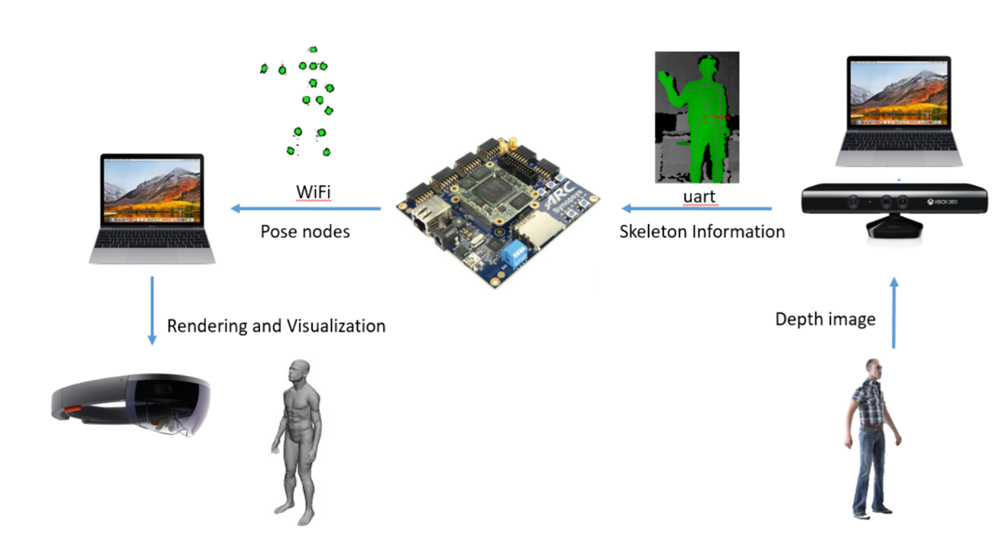
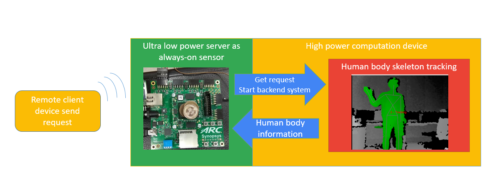
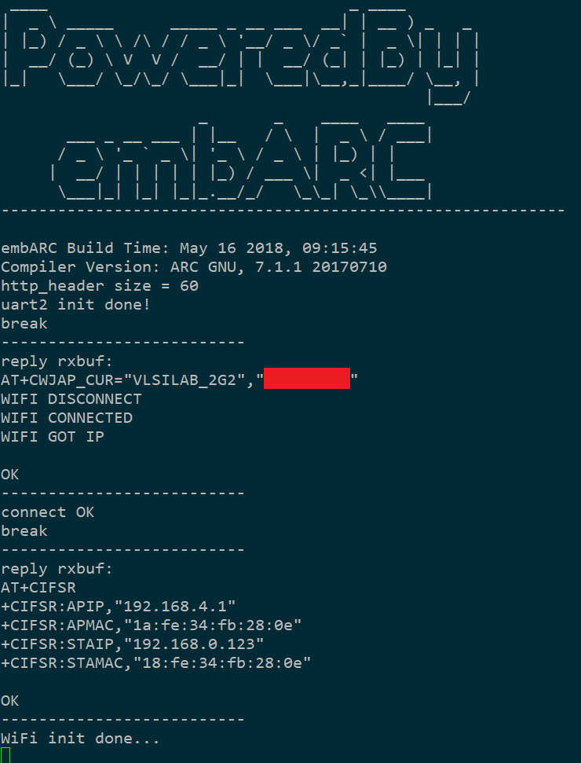
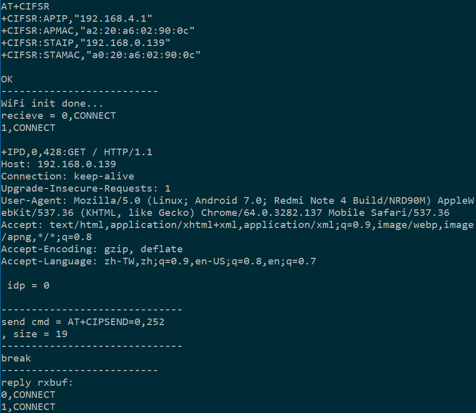

# EMSK ARC 3D Remote Communication and Interaction

Contents
--------

- [Introduction](#introduction)
- [Required Hardware](#required-hardware)
- [Require Software](#require-software)
- [Hardware Connection](#hardware-connection)
- [Architecture](#architecture)
- [User Manual](#user-manual)
    - [Installations](#installations)
        - [FTDI FT2232 dirver](#ftdi-ft2232-dirver)
        - [OpenNI](#openni)
    - [Usage](#usage)
        - [PC](#pc)
        - [ARC](#arc-platform)
        - [Client](#client)

## Introduction
3D remote interaction as following show.

## Result

  

  

## Required Hardware
* DesignWare ARC EM Starter Kit(EMSK)
* ESP8266 WiFi module
* FTDI FT2232 usb to UART module
* WiFi Hotspot
* Depth camera module (PC + Kinect) 
* client (HoloLens, PC, Smart phone, etc.)

## Require Software
* Metaware or ARC GNU Toolset
* OpenNI
* Robot OS (ROS) (for linux environment)
* Client display

## Hardware Connection

  

## Architecture

The communication system is driven by EMSK ARC, which is a low power always on processor, waiting until one make a call and then power up the depth camera system.  

We can get human skeleton by **depth camera module**. (In our case we use kinect and PC and get skeleton by OpenNI skeleton algorithm.)  
Then we using **ROS** to integrate to environments (camera informations, skeleton informations and ftdi transition) and sent the detected skeleton to ARC through **FTDI FT2232** chip.  

The **EMSK ARC**, which serve as the low power server, collect the detected skeleton and process the skeleton nodes let the client can easliy handle these informations. The connection between the client and ARC is the socket portocal and ARC will send the infomations to client by **ESP8266 WiFi module**.  

The client (At least PC, we use extra device to make more usage scenarios) recieve the infomations and apply the human body pose to the 3D hologram with few computations and we will able to interact with the hologram!  

# User Manual
## Installations
There are some pre-request software dependencies to run our work.

### FTDI FT2232 dirver 
Refer the download page of [libftdi1](https://www.intra2net.com/en/developer/libftdi/download.php)

### Robot OS (ROS)
Refer to the [ROS offical](http://wiki.ros.org/kinetic/Installation) site for the installation informations

### OpenNI 
installation steps:

First install the openni and kinect driver

    $ mkdir ~/src
    $ cd ~/src
    $ git clone https://github.com/avin2/SensorKinect
    $ cd SensorKinect/Bin
    $ tar xjf SensorKinect093-Bin-Linux-x64-v5.1.2.1.tar.bz2
    $ cd Sensor-Bin-Linux-x64-v5.1.2.1
    $ sudo ./install.sh
    
Then install the human body skeleton tracking

    $ cd ~/catkin_ws/src (change to match your catkin workspace directory)
    $ git clone -b hydro-devel https://github.com/pirobot/skeleton_markers.git
    $ cd ~/catkin_ws
    $ catkin_make
    $ rospack profile

### HoloLens develop tools
Refer to the [HoloLens tools](https://docs.microsoft.com/en-us/windows/mixed-reality/install-the-tools) site for relative files.
At least, you must to be familier with the tutorial [100](https://docs.microsoft.com/en-us/windows/mixed-reality/holograms-100), [101](https://docs.microsoft.com/en-us/windows/mixed-reality/holograms-101) in order to re-build our HoloLens mobile App.

## Usage
There are three part to start our work. **PC for human body tracking**, **ARC platform for saving power and handle data transmission**, **Client for user applications realization**  

### Linux-x64 
    $ cd skeleton/
    $ catkin_make -DCMAKE_BUILD_TYPE=release  
    $ source devel/setup.bash
    $ roslaunch skeleton_markers ARC_demo.launch
    
### Windows application   
2018/7, Add the **win10 x86-64 executable** to run the skeleton applications.   
Just run the Viewer.exe can start to skeleton by using kinect.   

### ARC platform
Make sure the EMSK version is 2.2 and all configures are the same as makefile.  

    $ cd #(ARC_PATH)
    $ make run
    
1. Start the EMSK ARC to wait for call.

2. User make a call to EMSK, then the EMSK ARC will poewer up the depth camera module and sent the detect human body infomations back.

3. The ARC will process the recieve skeleton andsent the informations to client.

### Client 
1. You must be familier with the develop of HoloLens UWP mobile APP using Unity3D, or you probably make a failure of building this.
2. Follow the [Holograms 101](https://docs.microsoft.com/en-us/windows/mixed-reality/holograms-101), and you can use the project in the client folder.
3. Change the IP address to the IP of esp8266 in CubeCommands.cs.
4. Using Holographic Emulation to sync HoloLens and press play in unity editor; then air tab the GameObject Cube.
4. Our project provide two kinds of 3D human model to experience 3D remote body interaction.if you can success use the project in client folder, and you can change the model by following steps.
    step1. Remove all the script component under the GameObject TransformCentroller and drag c# script ChanTransform(for unity-chan model) or TransformCenter(for Alpha@Alpha).\r
    step2. Enable the GameObject unitychan or Alpha@Alpha.\r
    step3. Modify the attributes \_transCenter type like TransformCenter or ChanTransform and the initial value in Start method in c# script CubeCommands.cs.\r
    step4. press play.\r

### Alternative client of HoloLens
We have not implemented any other client, but you can build yourself and can follow the below rule.
Client send a request for esp8266 server, and client will keep get a byte array with length 252 which is composed up from 15 group of 4 floats, represented quaternion of each joint, and 3 floats, represented the torso position relative to depth camera.

**Note: We had little time to complete this work. If we advance to the second round, we will make it more.**

