# Intelligent Home Hosting System Based on ARC EM Processor

## Introduction 

Based on the ARC EM Starter Kit development board, this design completes a smart home hosting system that implements the following features:

- Aquarium automatic timing and remote control feeding, automatic water circulation
- Plant growth environment monitoring, automatic watering to adjust soil moisture
- Indoor living environment monitoring, including temperature and humidity detection, sensitive gas detection, PM2.5 detection, adaptive ventilation, etc.

All data can be uploaded to the IoT cloud platform via WiFi, support remote viewing and control of mobile APP, and also support close-range voice control.

[Show video](http://v.youku.com/v_show/id_XMzYzMTYyNzY4MA==.html?spm=a2h0k.11417342.searchresults.dtitle)

## Hardware and Software Setup 

### Hardware requirements

|                   Item                   | Quantity | Directions                               |
| :--------------------------------------: | :------: | :--------------------------------------- |
| [ARC EM Starter Kit(EMSK)](www.synopsys.com/dw/ipdir.php?ds=arc_em_starter_kit) |    3     | Used as the control center for three subsystems |
| [ESP8266 ESP01-S WiFi Module](www.ai-thinker.com) |    3     | Each of the three development boards is connected to the IoT cloud platform through the WiFi module |
|               WiFi Router                |    1     | WiFi module connects to the Internet via the WiFi router with Internet access |
| [DHT11 Temperature and humidity sensor](https://detail.tmall.com/item.htm?spm=a230r.1.14.9.7aa72013MKTmPK&id=41248630584&cm_id=140105335569ed55e27b&abbucket=17) |    2     | Used to detect the temperature and humidity of the indoor environment and the plant growth environment |
| [DS18B20 Temperature Sensor](https://detail.tmall.com/item.htm?spm=a230r.1.14.9.6c71108eERVetZ&id=41251333448&cm_id=140105335569ed55e27b&abbucket=17) |    1     | Used to detect water temperature in the aquarium |
| [MQ-2 sensitive gas detection module](https://detail.tmall.com/item.htm?spm=a1z10.3-b-s.w4011-16538328900.46.6e1c3d6cdb1qlO&id=41265308241&rn=1e61c43016672601973742e420a01586&abbucket=11) |    1     | Used to detect flammable gases and fumes in indoor environments |
| [GP2Y1051AU0F Dust sensor](https://item.taobao.com/item.htm?spm=a1z09.2.0.0.52ff2e8dhF0kKJ&id=44400981264&_u=ovrnal8ae36) |    1     | Used to detect dust and PM2.5 concentrations in indoor environments |
|              Buzzer module               |    1     | For hazard warning                       |
| [Relay module](https://detail.tmall.com/item.htm?id=543199943481&spm=a1z09.2.0.0.52ff2e8dhF0kKJ&_u=ovrnal85d05) |    1     | Used to control the fluorescent switch   |
| [Adjustable voltage boosting module](https://item.taobao.com/item.htm?spm=a1z09.2.0.0.52ff2e8dhF0kKJ&id=522572949297&_u=ovrnal87651) |    1     | The output voltage of the ARC EM development board is 3.3V, some modules need 5V voltage supply, so use the boost module to output 5V voltage. |
| [Current drive module](https://detail.tmall.com/item.htm?id=536770526104&spm=a1z09.2.0.0.52ff2e8dhF0kKJ&_u=ovrnal8a8e6) |    4     | For driving small pumps and relay modules |
|                 SD card                  |    3     | Used to store applications               |
| [PMOD AD2](https://store.digilentinc.com/pmod-ad2-4-channel-12-bit-a-d-converter/) |    2     | Used to acquire analog output values for MQ-2 and light sensors |
| [Light intensity sensor](https://detail.tmall.com/item.htm?spm=a1z10.3-b-s.w4011-17145939501.30.48035535tIh32d&id=20885572596&rn=96a3c5ec08d9a9684444ba554871949c&abbucket=17) |    1     | Used to collect light intensity in the environment |
| [5V stepper motor and drive module](https://detail.tmall.com/item.htm?id=38688094766&spm=a1z09.2.0.0.52ff2e8dVPMtMj&_u=ovrnal8c843) |    1     | For driving aquarium feeding devices     |
| [5V small pumps](https://item.taobao.com/item.htm?spm=a1z09.2.0.0.52ff2e8dhF0kKJ&id=7184794953&_u=ovrnal8615b) |    2     | Used to water plants and aquarium water circulation |
| [Soil moisture sensor](https://detail.tmall.com/item.htm?id=37365775741&spm=a1z09.2.0.0.52ff2e8dVPMtMj&_u=ovrnal8c3c1) |    1     | Collecting plant soil moisture           |
| [XFS5152CE TTS module](https://detail.tmall.com/item.htm?spm=a230r.1.14.17.19797e5cbMQ3sr&id=41363527043&cm_id=140105335569ed55e27b&abbucket=6) |    1     | Used to synthesize and play voice        |
| [LD3320 Speech recognition module](https://detail.tmall.com/item.htm?spm=a230r.1.14.17.1fda7ccdpzaHwl&id=41365254224&cm_id=140105335569ed55e27b&abbucket=6) |    1     | Used for speech recognition and providing a VUI |
### Software Requirements
[ARC GNU Toolchain](https://github.com/foss-for-synopsys-dwc-arc-processors/toolchain/releases)

[embARC Open Software Platform (OSP) ](https://github.com/foss-for-synopsys-dwc-arc-processors/embarc_osp) 

[PUTTY](https://www.chiark.greenend.org.uk/~sgtatham/putty/latest.html)

### Hardware connection
As the aquarium box system control center, EMSK1 is responsible for collecting the water temperature of the aquarium, controlling the stepping motor to automatically feed, controlling the water pump to perform water circulation, uploading sensor data and receiving control signals through WiFi. The hardware connection is shown below.
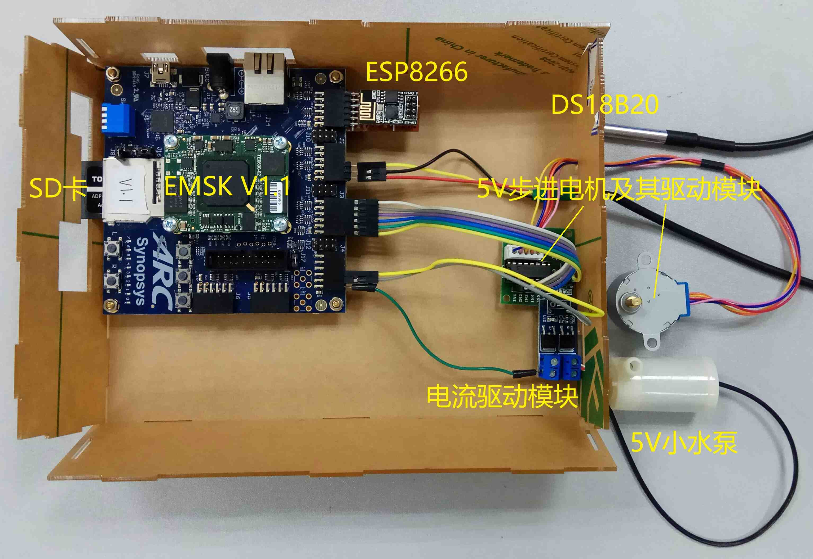

As the control center of the plant survival maintenance subsystem, EMSK2 is responsible for collecting the soil moisture of the flowerpot, the temperature and humidity in the environment, and watering the pot by controlling the water pump to adjust the soil moisture to make the plant survive in a relatively suitable environment. . These sensor data and control signals are also uploaded via WiFi. The hardware connection is shown below.
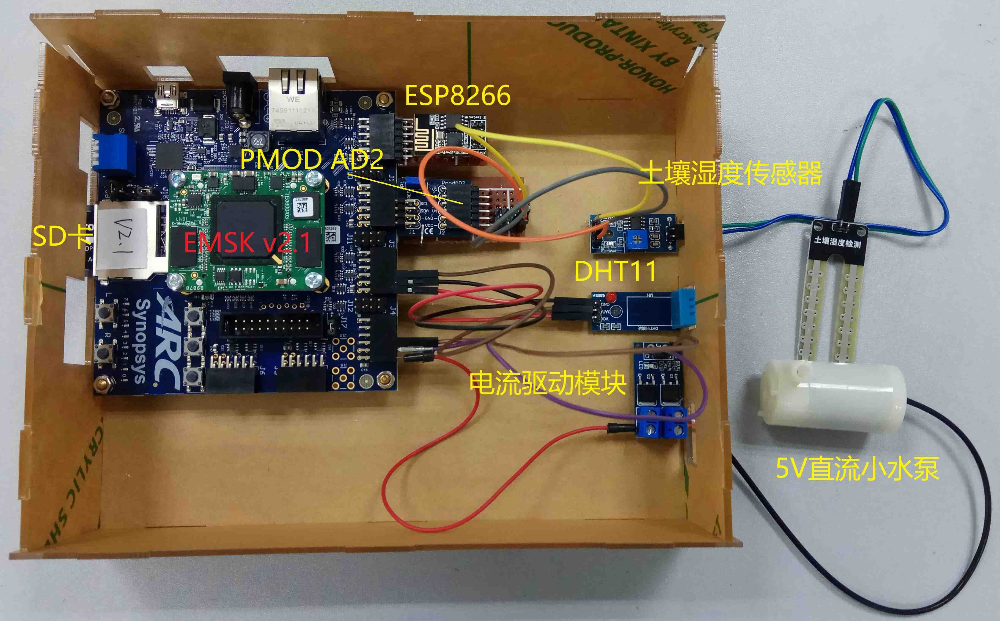

As the control center of the indoor living environment monitoring subsystem, EMSK3 is responsible for collecting indoor temperature and humidity information, detecting flammable sensitive gas, detecting light intensity, detecting PM2.5 content, and controlling indoor light intensity and ignitability by controlling fluorescent lamps and exhaust fans. Gas and the like are adjusted. At the same time, the sensor data is uploaded via WiFi and the corresponding control signals are accepted. The hardware connection diagram is as follows.
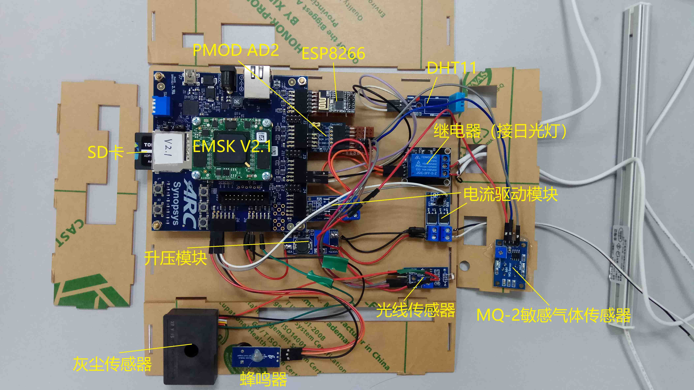

As the voice control assistant's control center, EMSK4 is responsible for receiving and recognizing voice commands from users, controlling other sub-devices through WiFi to react, and using voice feedback to control the corresponding control results. The hardware connection diagram is as follows.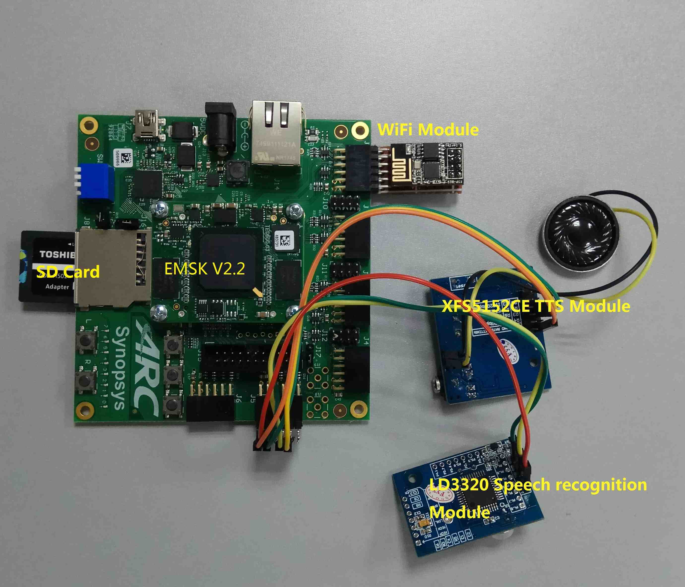

## User manual

### Download GAgent firmware into ESP8266 ESP01-S WiFi module

Please visit the Gizwits website for detailed information.[Gizwits Introduction](http://docs.gizwits.com/en-us/overview/overview.html) [Firmware User manual](http://docs.gizwits.com/zh-cn/deviceDev/ESP8266%E4%B8%B2%E5%8F%A3%E7%83%A7%E5%86%99%E8%AF%B4%E6%98%8E.html)

### Compile and run the application

#### 0. Preparation

- Copy the four source code folders under the src folder to `($embARC)/applications/SmartHomeSystem/ `(($embARC) for the embARC package root directory)

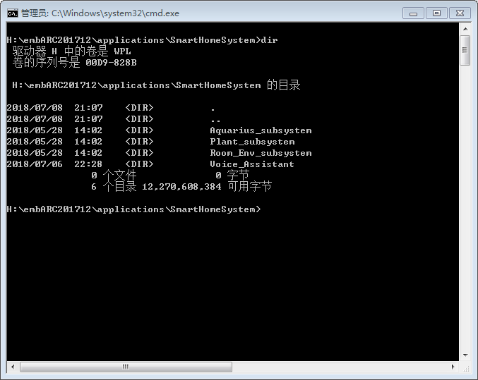

- Download and install device management software for viewing device status and control devices. Download link: https://download.gizwits.com/zh-cn/p/98/99

#### 1. Compile and run the Aquarium System application
- Go to the Aquarius_subsystem folder and modify the Makefile according to your development board version and processor model (using the EMSK V2.2 development board, em7d processor as an example).

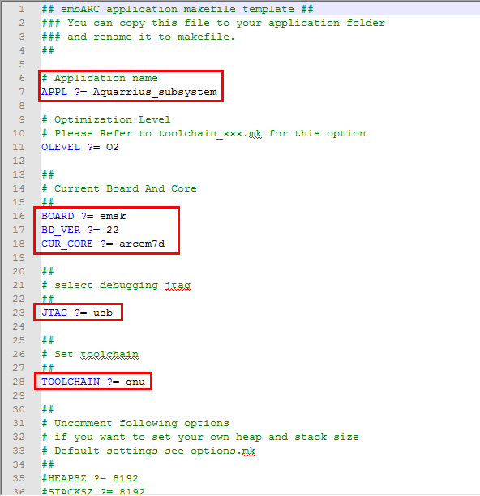

- Open CMD or PowerShell in the Aquarius_subsystem folder and type the **make** command to compile.

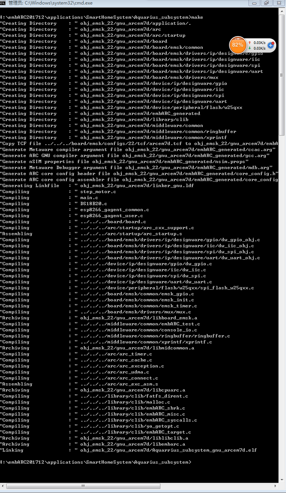

- Connect the host and development board with a USB cable, and run the target program by entering the **make run** command in CMD or PowerShell.
- Open the device management app, bind the device and control it.

#### 2. Compile and run the Plant Subsystem application
- Go to the Plant_subsystem folder and modify the Makefile according to your development board version and processor model (using the EMSK V2.2 development board, em7d processor as an example).

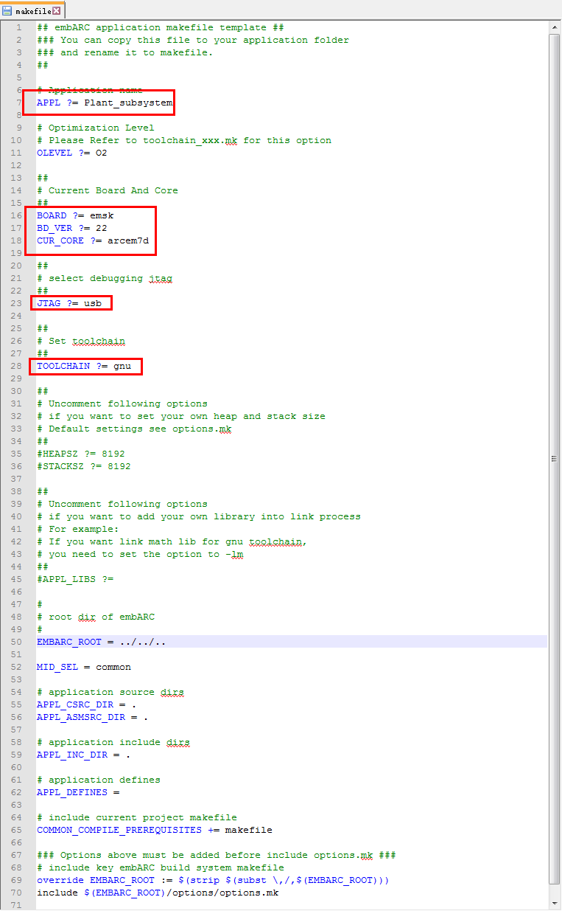

- Open CMD or PowerShell in the Plant_subsystem folder and type the **make** command to compile.

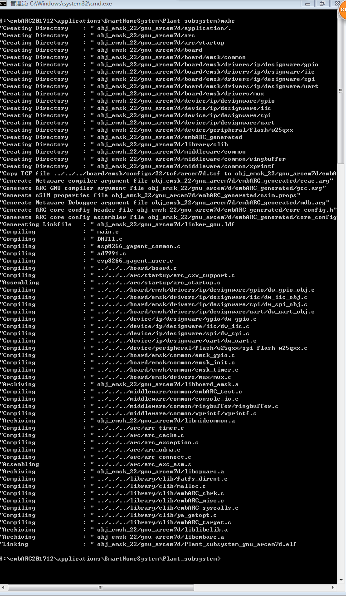

- Connect the host and development board with a USB cable, and run the target program by entering the **make run** command in CMD or PowerShell.
- Open the device management app, bind the device and control it.

#### 3. Compile and run the Room environment monitoring subsystem application
- Go to the Room_Env_subsystem folder and modify the Makefile according to your development board version and processor model (using the EMSK V2.2 development board, em7d processor as an example).

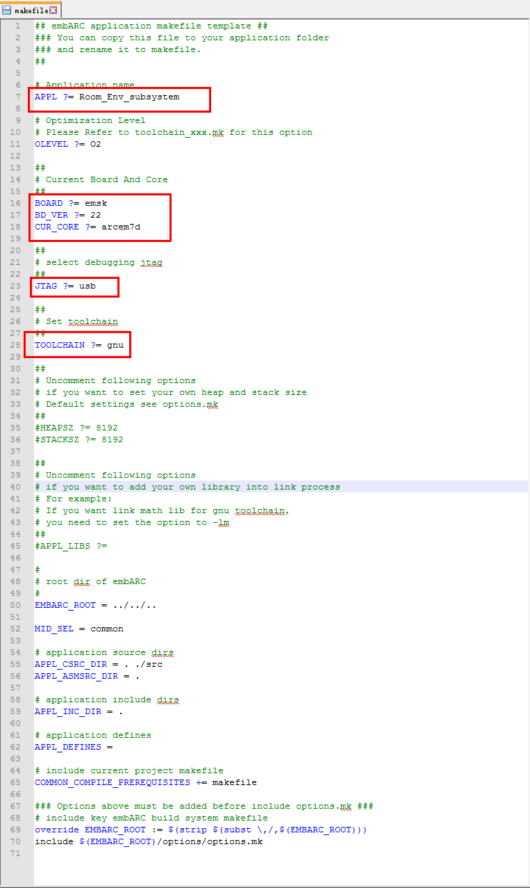

- Open CMD or PowerShell in the Room_Env_subsystem folder and type the **make** command to compile.

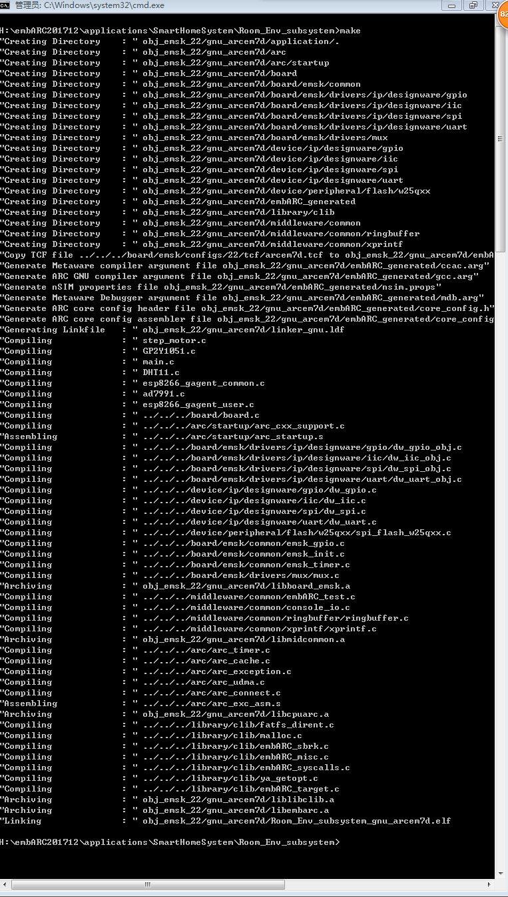

- Connect the host and development board with a USB cable, and run the target program by entering the **make run** command in CMD or PowerShell.
- Open the device management app, bind the device and control it.

#### 4. Compile and run the Voice Assistant application
- Go to the Voice_Assistant folder and modify the Makefile according to your development board version and processor model (using the EMSK V2.2 development board, em7d processor as an example).

- Open CMD or PowerShell in the Voice_Assistant folder and type the **make** command to compile.

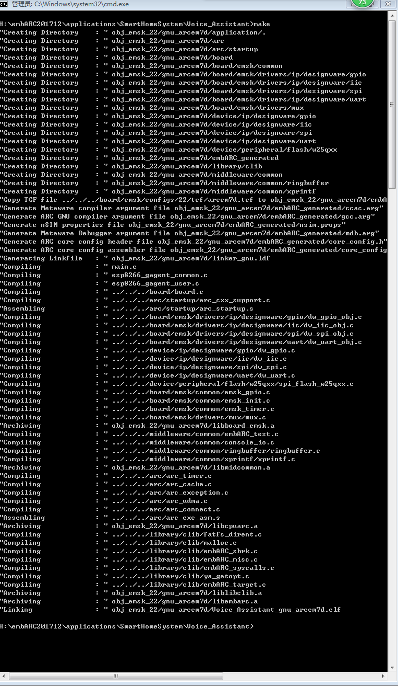

- Connect the host and development board with a USB cable, and run the target program by entering the **make run** command in CMD or PowerShell.
- Open the device management app, bind the device and control it.

For more information, see the following link:

[Picture of Work details No.1](https://github.com/BarryWang2017/2018_ARC_competition/blob/master/close_up_1.png)
[Picture of Work details No.2](https://github.com/BarryWang2017/2018_ARC_competition/blob/master/close_up_2.png)
[Picture of Work details No.3](https://github.com/BarryWang2017/2018_ARC_competition/blob/master/close_up_3.png)
[Picture of Work details No.4](https://github.com/BarryWang2017/2018_ARC_competition/blob/master/APP_interface.png)
