# New Vision World
  Welcome to New Vision World! 
  :smile:
  
  We are ready to show you how New Vision World works. 

  
# Contents

- [Introduction](#Introduction)
    - [Function](#Function)
    - [Architecture](#Architecture)
- [Hardware and Software Setup](#Hardware-and-Software-Setup)
    - [Required Hardware](#Required-Hardware)
    - [Required Software](#Required-Software)
    - [Hardware Connection](#Hardware-Connection)    
    - [Component detail](#Component-detail)
- [User Manual](#User-Manual)
    - [Before Running This Application](#before-running-this-application)
    - [Run This Application](#run-this-application)
    
# Introduction

  Previously, musicians need to have an instrument to perform or practice, and today hand movement of many virtual instruments are detected by wearable devices. With the rapid development of technology, the image recognition of people’s movements and postures is becoming more and more accurate. Therefore, our team hopes to get information of hand movement based on image-related technology without additional wearable devices to let users play the virtual instrument more comfortably. Finally, designing an IoT process to combine more possibilities between technology and multimedia.

## Function
View of piano from user:

Three instruments including piano, drum, and guitar viewed from HoloLens:
  
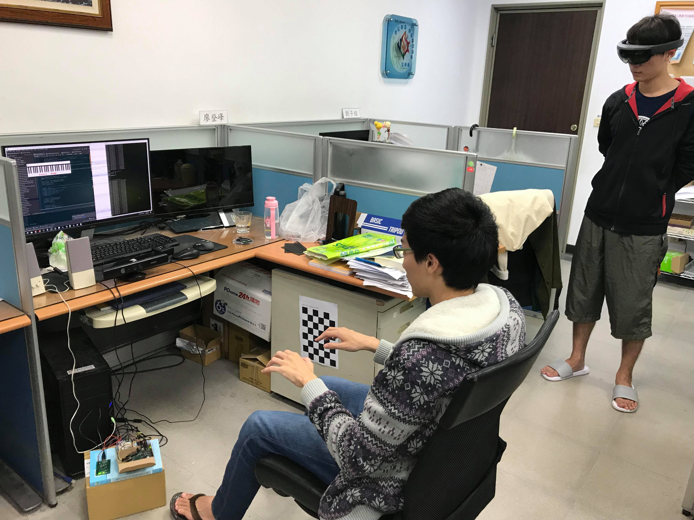

  
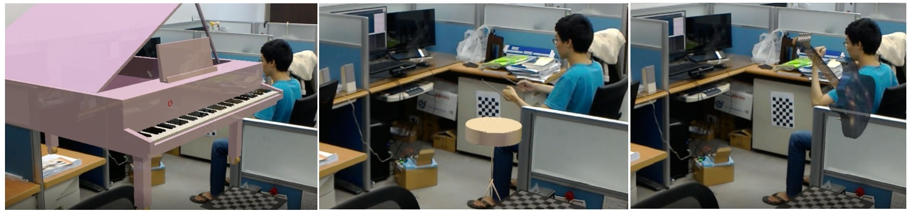

## Architecture

  System begins in Kinect camera to get RGB information of image. Through the open source called OpenPose, we can generate skeleton of body and keypoints of two hands. Then the computer outputs these information to ARC and doing SVM algorithm to verify each instrument with many different sounds. After getting the result of verification and sounds, we output the data to HoloLens to have a real stage to perform every instuments. 
  
  * The main flow is following:
 
  
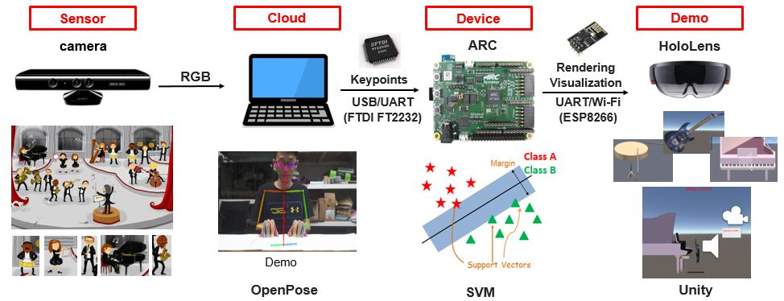

  
# Hardware and Software Setup

## Required Hardware
* ARC IoT Development Kit (IoTDK) 
* ESP8266 Wi-Fi module
* FTDI FT2232 USB to UART module
* Camera (Kinect or any other webcam)
* Client (HoloLens, etc.) 

## Required Software
* ARC GNU Toolchain
* OPENNI (for kinect camera here)
* OpenPose (please click [here](https://github.com/CMU-Perceptual-Computing-Lab/openpose) for much more detail requirements), and check GPU performance [here](https://docs.google.com/spreadsheets/d/1-DynFGvoScvfWDA1P4jDInCkbD4lg0IKOYbXgEq0sK0/edit#gid=0). We use GTX 1080 in this project.
* [LIBSVM](https://www.csie.ntu.edu.tw/~cjlin/libsvm/) (a library for Support Vector Machines) 

## Hardware Connection
1. Connect Kinect camera to PC (USB port) and power-supply 
2. Connect ESP8266 Wi-Fi module to ARC
3. Connect ARC IoT Development Kit (IoTDK) to PC (USB port) and power-supply 
4. Connect FTDI FT2232 USB to UART module to PC (USB port)
5. Connect HoloLens to communicate with ARC

* Pin of ARC, p_mod and Wi-Fi module:
  
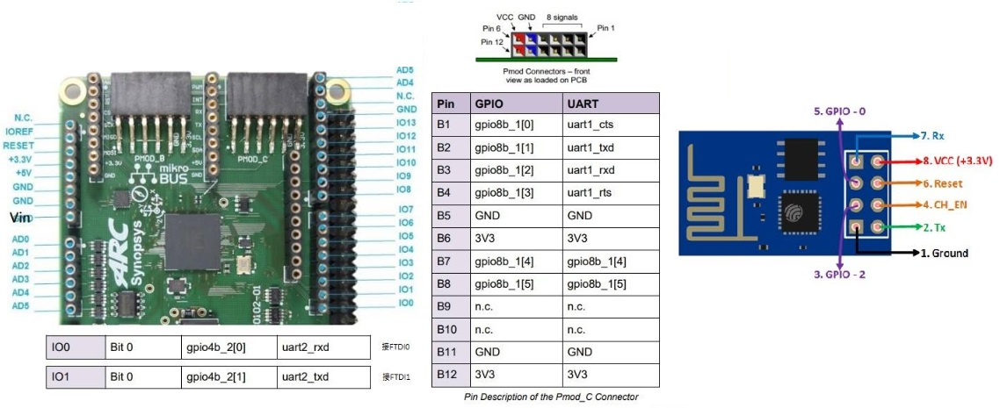

  
  
* Real connection between ARC and FTDI and Wi-Fi module: 
  
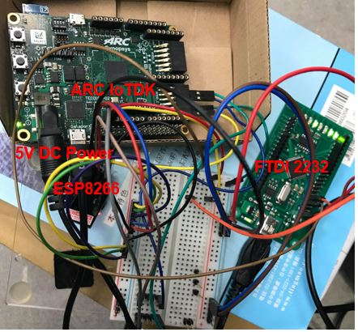
  

## Component details

* Kinect for Xbox 360 (Kinect) camera 

    Kinect is created by Microsoft and it has three lens. We use kinect to get real-time RGB information for each image. Before we driver kinect, we use the library called Open Natural Interface(OpenNI) to finish driving.

* ARC

  See [toolchain](https://github.com/foss-for-synopsys-dwc-arc-processors) and GNU Toolchain for much more detail.
  
* USB-FTDI module

  It needs to transfer data between the computer and ARC through USB. We choose FT2232HL chip to transfer. [See the document we use.](https://www.intra2net.com/en/developer/libftdi/download.php)

* WIFI – TCP/IP 

  The WIFI module we used is ESP8266. ARC is the srver and HoloLens is the client. When HoloLens connect to ARC, ARC will transfer 32-bits data contiuously to HoloLens. The flow is following:

  
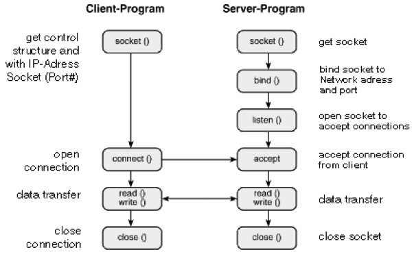

* HoloLens

  Microsoft HoloLens is an Augmented Reality (AR) device developed by Microsoft. It is part of the Windows Mixed Reality AR Platform incorporated with Windows 10 OS. Similar to other OHMDs (optical head-mounted displays), HoloLens is a see-through display worn over your eyes. Unlike the Oculus Rift and other VR Devices, the eye-piece component of HoloLens is transparent and the headset requires neither PC nor smartphone. It is able to project high-definition (HD) virtual content or holograms over real world objects. 

  
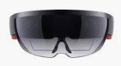

* OpenPose

    [OpenPose](https://github.com/CMU-Perceptual-Computing-Lab/openpose) represents the first real-time multi-person system to jointly detect human body, hand, facial, and foot keypoints (in total 135 keypoints) on single images. It has been widely used in many applications. Here, in order to verify different instruments, we gonna use body and hands information to do SVM training and testing.  
    The skeleton of body and keypoints of hands are following:
   
   
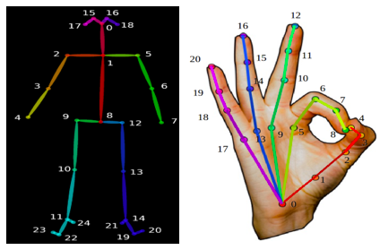

* Support vector machines(SVM)

  SVM is a discriminative classifier formally defined by a separating hyperplane. In other words, given labeled training data (supervised learning), the algorithm outputs an optimal hyperplane which categorizes new examples. In two dimentional space this hyperplane is a line dividing a plane in two parts where in each class lay in either side. We train model with 200 data per class. 
 
# User Manual

## Before Running This Application
* You need to install (Most software are implemented on python and you need to have GPU 1080 up):
1. ARC GNU Toolchain
2. Third party on python
* OpenPose (please click [here](https://github.com/CMU-Perceptual-Computing-Lab/openpose) for much more detail requirements)
* Pybind for FTDI: Download (path) to finish binding c program and python to do FTDI and more detail of FTDI FT2232 driver with [libftdi](https://www.intra2net.com/en/developer/libftdi/index.php)
* OpenNI for Kinect: You can include (/OpenNI) to your file or go to [github](https://github.com/avin2/SensorKinect) for more detail.
* HoloLens: Refer to the [HoloLens tools](https://docs.microsoft.com/en-us/windows/mixed-reality/install-the-tools) site for relative files.
* [LIBSVM](https://www.csie.ntu.edu.tw/~cjlin/libsvm/) for SVM
* Thread for running program parallel
* Playsound for playing music

## Run This Application
1. Run ARC and initial
  
      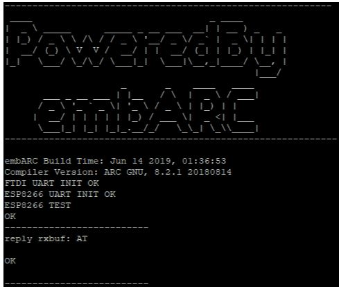
  
2. ARC connects FTDI to communicate with PC
  
      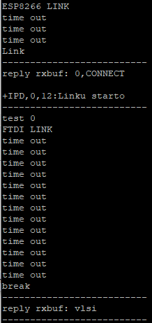
  
3. ARC connects Wi-Fi to communicate with HoloLens
  
      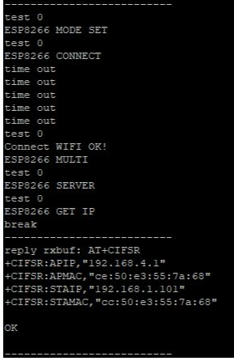
  
  * Through HoloLens connects to ARC, it will show a debug box and a buttom of connection to ARC
    
    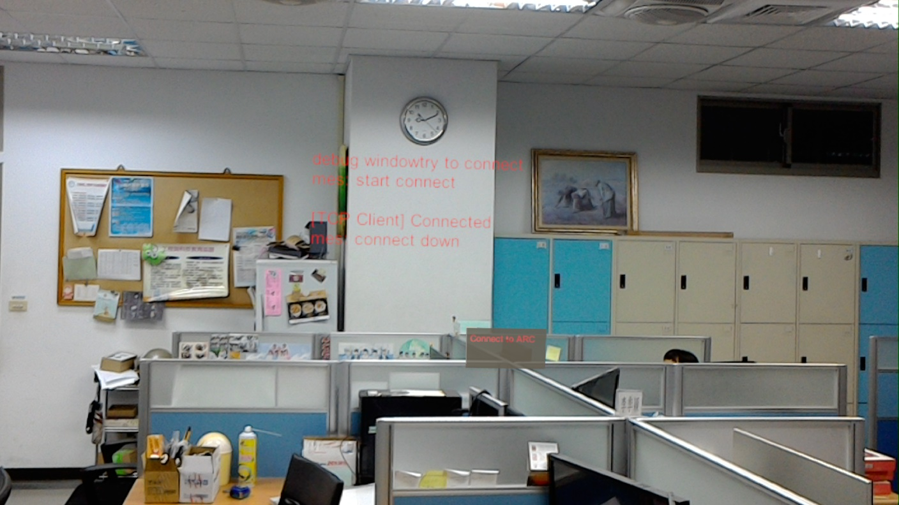

4. Run python code to send keypoints from PC to ARC

