# NCKU_Sport_At_Home

* [Introduction](#introduction)
* [Demo Link](#demo-link)
* [System Architecture](#system-architecture)
* [Hardware and Software Setup](#hardware-and-software-setup)
	* [Hardware Setup](#hardware-setup)
	* [Software Setup](#software-setup)
* [User Manual](#user-manual)
	* [SoftWare Environment](#software-environment)
	* [HardWare Environment](#hardware-environment)
	* [Download Source Code](#download-source-code)
	* [Run Code](#run-code)
		* [embARC](#embarc)
		* [Unity](#unity)
	* [How to play?](#how-to-play)
		* [Ball pitch setting](#ball-pitch-setting)
		* [Ball velocity setting](#ball-velocity-setting)
		* [Ball position setting](#ball-position-setting)
* [Problem](#problem)

## Introduction
This project titled **Sport, at home** is designed to allow batters to practice indoors during the Coronavirus Outbreak which combines ARC IOTDK to implement voice recognition to operate the game interface , KINECT V2 to detect batters' motions and UNITY to create a simple 3D baseball game.
## Demo Link 
[Click here](https://v.youku.com/v_show/id_XNDc5MDEwMjUwNA==.html)  

## System Architecture
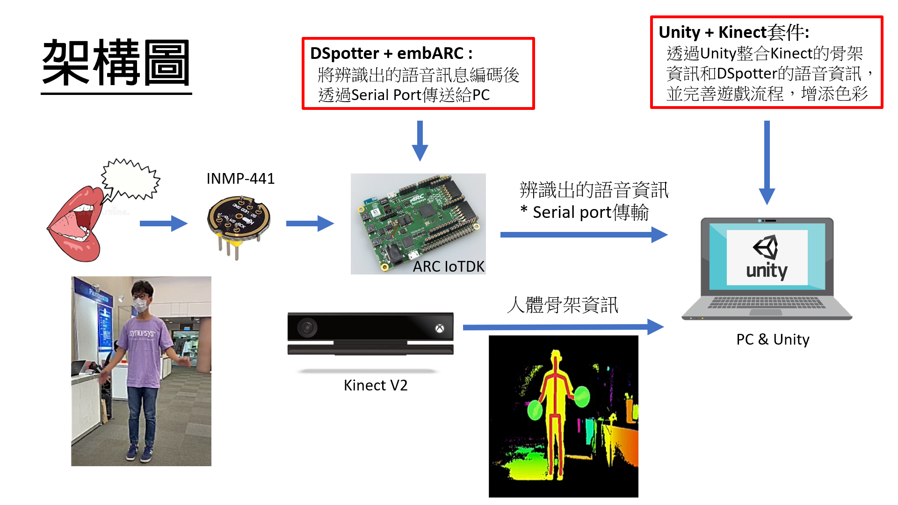  
## Hardware and Software Setup
### Hardware Setup
The Hardware requirements are as below:
- DesignWare ARC IoT Development Kit
- inmp-441(voice sensor)
- KINECT V2(xbox one)
- PC
- Micro USB To USB **x1**

### Software Setup
The Software requirements are as below:
- embARC Open Source Platform
- MetaWare Development Toolkit & GNU Toolchain
- DSpotter(Cyberon)
- Unity + Kinect plugin
- Kinect for Windows SDK 2.0

## User Manual
### SoftWare Environment
1.	Installing [Unity](https://store.unity.com/?_ga=2.247763335.1014993985.1596985340-1590034984.1596985340#plans-individual)  
2.	Installing [Environmental Settings for ARC IoTDK](https://docs.google.com/presentation/d/1IZgiAmwunmWSda6N9_mpmO7g144-W_fN/edit#slide=id.p1)  
3.	Installing [Kinect for Windows SDK 2.0](https://www.microsoft.com/en-us/download/details.aspx?id=44561)
### HardWare Environment
1.	Connecting INMP441 & ARC
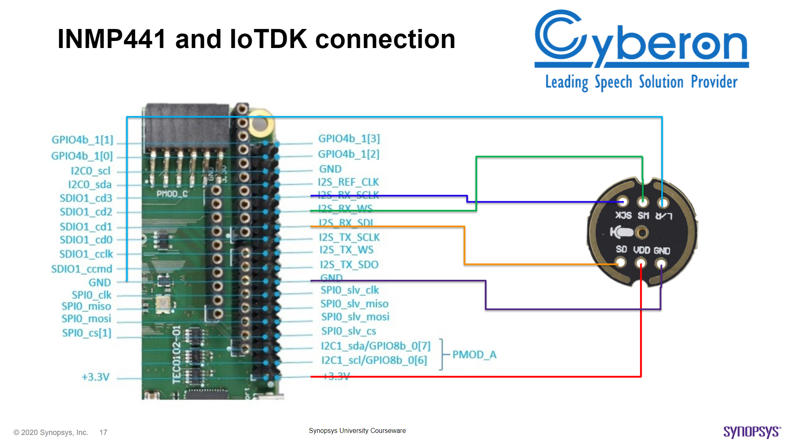
2.	Connecting ARC **(Dataport)** & PC by `Micro USB To USB`
3.	Connecting Kinect V2 & PC, then you can test it by `Kinect for Windows SDK 2.0` to confirm whether it works fine  
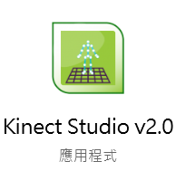
### Download Source Code
1.	Downloading `Unity_package` from [here](https://drive.google.com/drive/folders/1N7AXqAA_fNJt_3JR1my2e3aJU0aEI18h)
2.	Downloading `embARC/DSpotter_Sport_at_home` from github
### Run Code
#### embARC
1.	Put `DSpotter_Sport_at_home` into embarc_osp
2.	Use `Visual Code` to open embarc_osp folder
3.	Let `terminal` go to `DSpotter_Sport_at_home`
4.	Key in `gmake TOOLCHAIN=mw BOARD=iotdk DIG_NAME=IoTDK gui`
5.	Click `ok` and wait a second
6.	Click `run`
#### Unity
1.	Open `Unity Hub` to create a new 3D repository  

2.	Click Assets -> Import Package -> Custom Package  
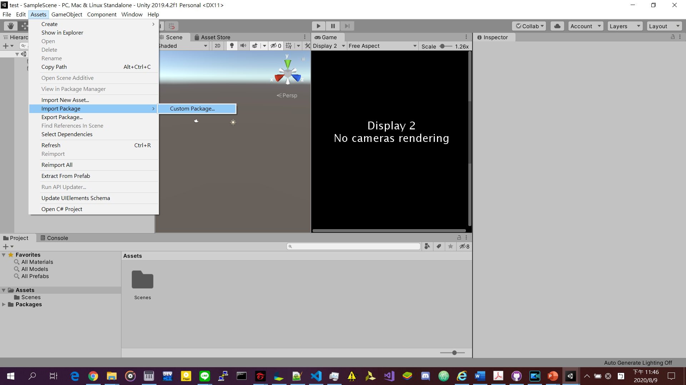
3.	Open Sport_at_home.unitypackage  
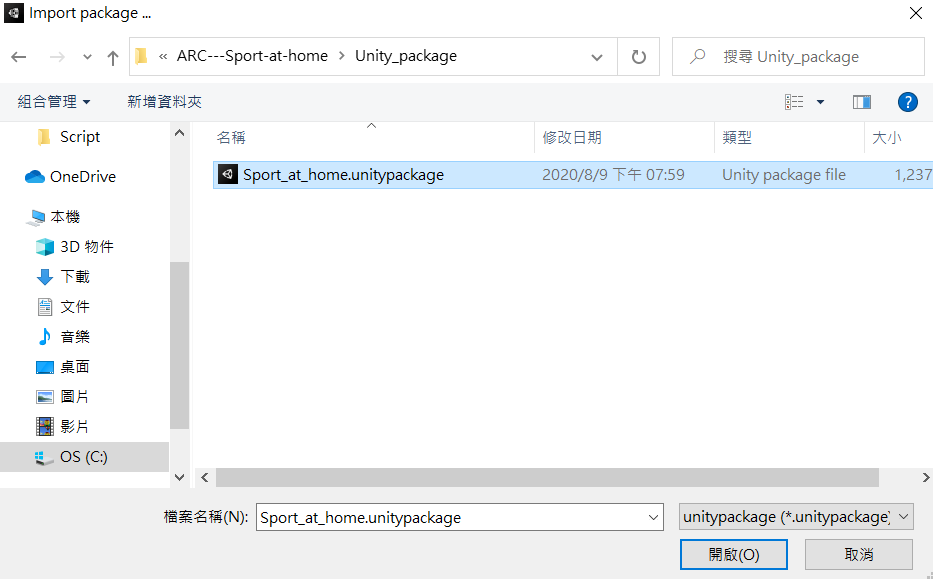
4.	Import All  
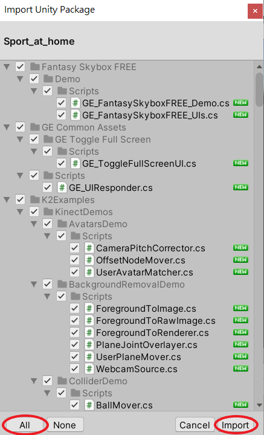
5.	Double Click Scenes -> Baseball, then you can find the blue square appear  
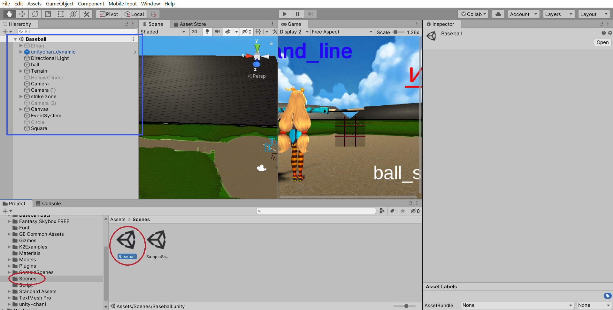
6.	Choose Game -> Display2  
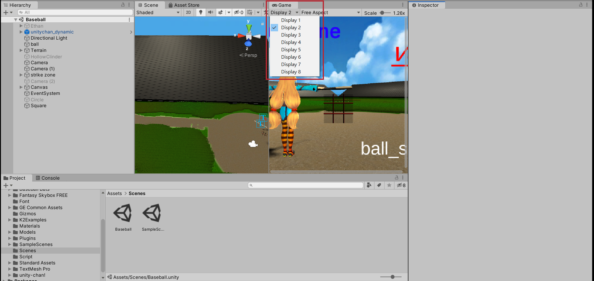
7.	Click Run ! (You can click `Maximize` to maximize the game window, or Click `Maximize On Play` before Click Run)  
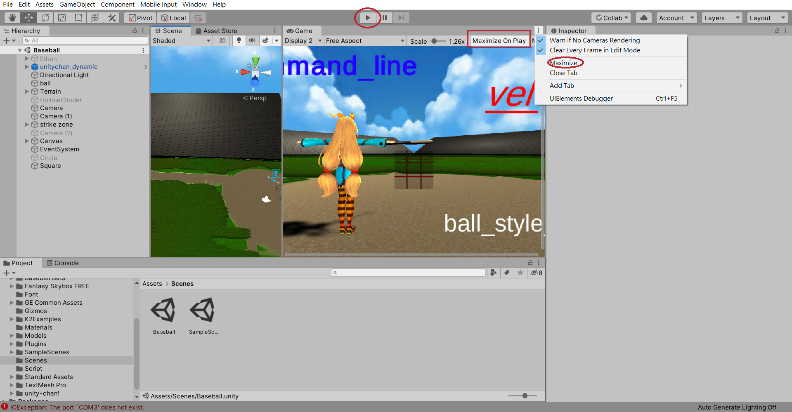

### How to play?
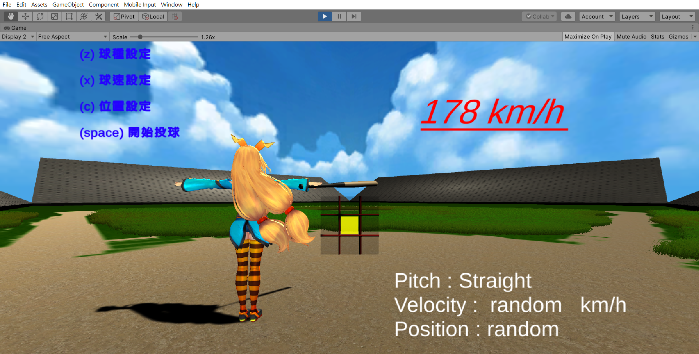
The list on the left is the instructions that you can release, you can use keyboard or voice to release it.  
Example :  
At the beginning,  
you can key in `z` or say `球種設定` in Chinese to `set the ball pitch`  
you can key in `x` or say `球速設定` in Chinese to `set the ball velocity`  
you can key in `c` or say `位置設定` in Chinese to `set the ball position`  
you can key in `space` or say `開始投球` in Chinese to `let the ball be thrown to you`  
  
The info which is white on the Bottom Right Corner is the setting you set now.  
At the beginning,  
the ball pitch is Straight ball  
the ball velocity is random  
the ball position is random  
  
The velocity which is red on the Upper Right Corner is the velocity of this pitch, it will be changed immediately when the next ball be pitched.  
At the beginning, it will display 178 km/h  
  
The 9 grids in the middle is 9 possible positions of the ball.  
The **yellow mark** is the position of this pitch, it will be changed immediately when the next ball be pitched.  
If you set `random` it will first be displayed at middle, then be changed immediately when the next ball be pitched.  
If you set `1~9` it will be displayed at the gird you set immediately.  
At the beginning, because the ball position is random, it will be displayed at middle.  
  
#### Ball pitch setting
You can set ball pitch by keying in `z` or say `球種設定` in Chinese  
Now, we only have Straight ball  
You can key in `1` or say `設定直球` in Chinese to set `Straight ball`  
You can key in `q` or say `取消設定` in Chinese to `quit setting`  
Initially, it is set `Straight ball`  
  
#### Ball velocity setting
You can set ball velocity by keying in `x` or say `球速設定` in Chinese  
We totally have 10 segments can be chose  
You can key in `0` or say `一百公里` in Chinese to set velocity between `100 ~ 109 km/h`  
You can key in `1` or say `一百一十` in Chinese to set velocity between `110 ~ 119 km/h`  
You can key in `2` or say `一百二十` in Chinese to set velocity between `120 ~ 129 km/h`  
You can key in `3` or say `一百三十` in Chinese to set velocity between `130 ~ 139 km/h`  
You can key in `4` or say `一百四十` in Chinese to set velocity between `140 ~ 149 km/h`  
You can key in `5` or say `一百五十` in Chinese to set velocity between `150 ~ 159 km/h`  
You can key in `6` or say `一百六十` in Chinese to set velocity between `160 ~ 169 km/h`  
You can key in `7` or say `一百七十` in Chinese to set velocity between `170 ~ 179 km/h`  
You can key in `8` or say `一百八十` in Chinese to set velocity between `180 ~ 189 km/h`  
You can key in `9` or say `一百九十` in Chinese to set velocity between `190 ~ 199 km/h`  
You can key in `r` or say `隨機設定` in Chinese to set velocity `random` which is between `100 ~ 199 km/h`  
You can key in `q` or say `取消設定` in Chinese to `quit setting`  
Initially, it is set `random`  
  
#### Ball position setting
You can set ball position by keying in `c` or say `位置設定` in Chinese  
We totally have 9 grids can be chose   
You can key in `1` or say `一號位置` in Chinese to set position at `Upper Left Corner`  
You can key in `2` or say `二號位置` in Chinese to set position at `Upper`  
You can key in `3` or say `三號位置` in Chinese to set position at `Upper Right Corner`  
You can key in `4` or say `四號位置` in Chinese to set position at `Left`  
You can key in `5` or say `五號位置` in Chinese to set position at `Middle`  
You can key in `6` or say `六號位置` in Chinese to set position at `Right`  
You can key in `7` or say `七號位置` in Chinese to set position at `Bottom Left Corner`  
You can key in `8` or say `八號位置` in Chinese to set position at `Bottom`  
You can key in `9` or say `九號位置` in Chinese to set position at `Bottom Right Corner`  
You can key in `r` or say `隨機設定` in Chinese to set position `random`  
You can key in `q` or say `取消設定` in Chinese to `quit setting`  
Initially, it is set `random`  
  
## Problem
If you have problem like below image, please check which `COM?` is your ARC connecting with PC, then double click Script -> adforce to revise `COM3` to your `COM?`  
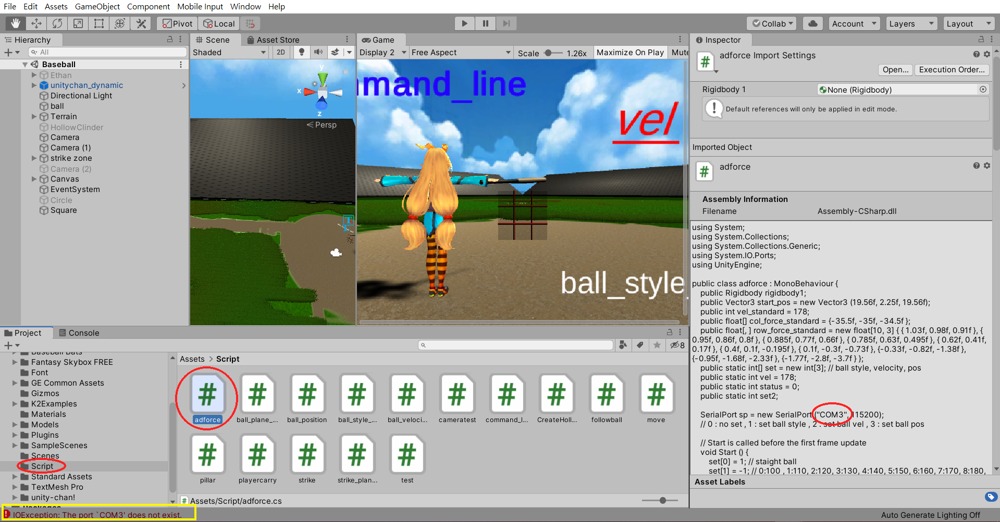
