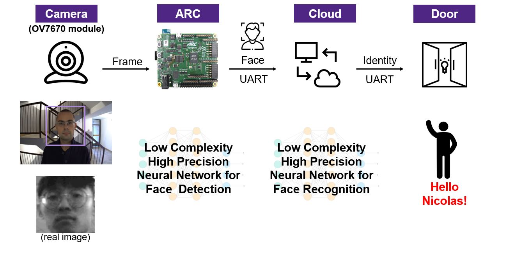

# NCKU Aitum Angelfish

## House Keeper - Smart Face Recognition System

## Introduction
Our goal is to implements light face detection CNN model on ARC IoTdk board, edge devices such as ARC IoTdk board has advantages like low power comsumption and reasonable price are very suitable for preprocessing or wake-up device of the back-end system(in this case, we use face recognition CNN model as our backend system).
## System architecture

## Required Hardware
- Camera : [OV7670](https://www.voti.nl/docs/OV7670.pdf)

- Always-On Face Detector Device : [ARC IoTDK](https://embarc.org/embarc_osp/doc/build/html/board/iotdk.html)

- Micro USB Cable

### Hardware cable connection
1.Connect ov7670 to IoTDK Board.

|ov7670|ARC: 2x18 Pin Extension Header|
|-|-|
| SCL|I2C0_SCL (need pull-up 10K resistor)|
| SDA|I2C0_SDA (need pull-up 10K resistor)|

|ov7670|ARC: Arduino PIN|
|-|-|
|VSYBC  |    arduino IO0|
|PCLK   |    arduino IO1|
|XCLK   |    arduino IO3|
|D7~D0  |    arduino IO4~IO11|
|3V3    | +3.3V|
|RESET  | +3.3V|
|GND    | GND|
|PWDN   | GND|

2.Connect IoTDK Board to computer with micro USB Cable.
## Required Software
- MetaWare Development Toolkit

- embARC Machine Learning Inference Library

- [embARC Open Software Platform (OSP)](https://github.com/foss-for-synopsys-dwc-arc-processors/embarc_osp/tree/embarc_mli)

## User Manual

#### Before running
- Download source code from github

- Setup hardware connection

- Goto `(embarc_osp)\middleware\common\console_io.c`

- Change

        console_uart = uart_get_dev(CONSOLE_UART_ID);

        console_uart->uart_open(BOARD_CONSOLE_UART_BAUD);

        xdev_in(console_getchar);
        xdev_out(console_putchar);
- to

    	console_uart = uart_get_dev(CONSOLE_UART_ID);

    	console_uart->uart_open(1500000);

    	xdev_in(console_getchar);
    	xdev_out(console_putchar);

- Goto `python\read.py` and `python\build.py`
  - In `port='COM3',`change `COM3` to the port which your IoTDK Board connect.

#### Run the application
##### To start face detection and recognition
- Type `python read.py` and wait the terminal to print `Configured`

- Type `make run` to download and start the program on IoTDK Board

- If terminal shows memory allocation error, open `obj_iotdk_10\mw_arcem9d\linker_mw.ldf`
- change

          GROUP : {
          .mli_model_p2 ALIGN(8): {
          _f_mli_model_p2 = .;
          *(.mli_model_p2 .mli_model_p2.*)
          _e_mli_model_p2 = .;
          }
          } > REGION_DCCM AT > REGION_ICCM

          _load_addr_mli_model_p2 = LOADADDR(.mli_model_p2);

          GROUP : {
          .mli_model ALIGN(8): {
          _f_mli_model = .;
          *(.mli_model .mli_model.*)
          _e_mli_model = .;
          }
          } > REGION_XCCM AT > REGION_ICCM

- to

        GROUP : {
        .mli_model_p2 ALIGN(8): {
        _f_mli_model_p2 = .;
        *(.mli_model_p2 .mli_model_p2.*)
        _e_mli_model_p2 = .;
        }
        } > REGION_DCCM AT > REGION_DCCM

        _load_addr_mli_model_p2 = LOADADDR(.mli_model_p2);

        GROUP : {
        .mli_model ALIGN(8): {
        _f_mli_model = .;
        *(.mli_model .mli_model.*)
        _e_mli_model = .;
        }
        } > REGION_DCCM AT > REGION_DCCM

- Type `make run` to download and start the program on IoTDK Board again

##### To sign up a new face ID in face recognition database
- Type `python build.py (yourname)` ,you can set `(yourname)` parameter to any name you want and wait the terminal to print `Configured`.

- Type `make run` to download and start the program on IoTDK Board.

- Type any key and the system will sign up camera's current frame with `(yourname)`.
