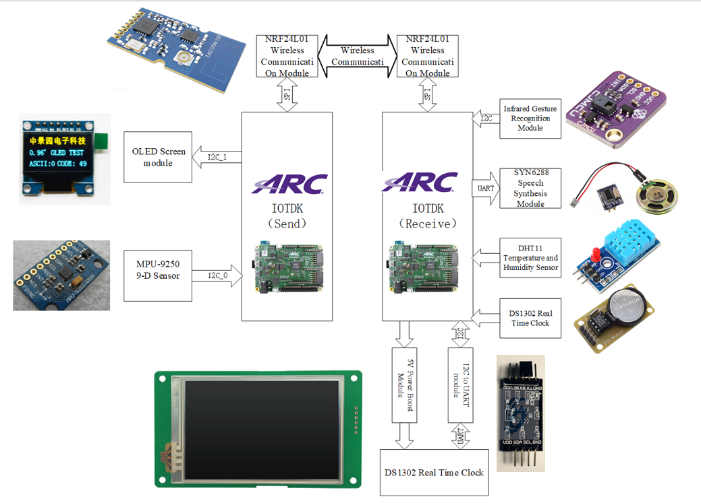
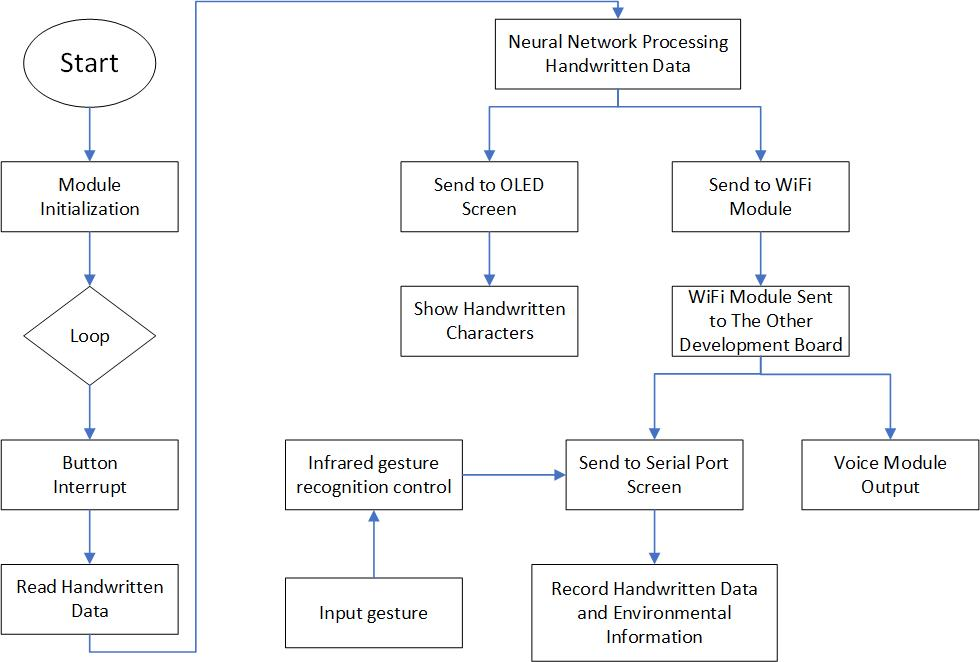
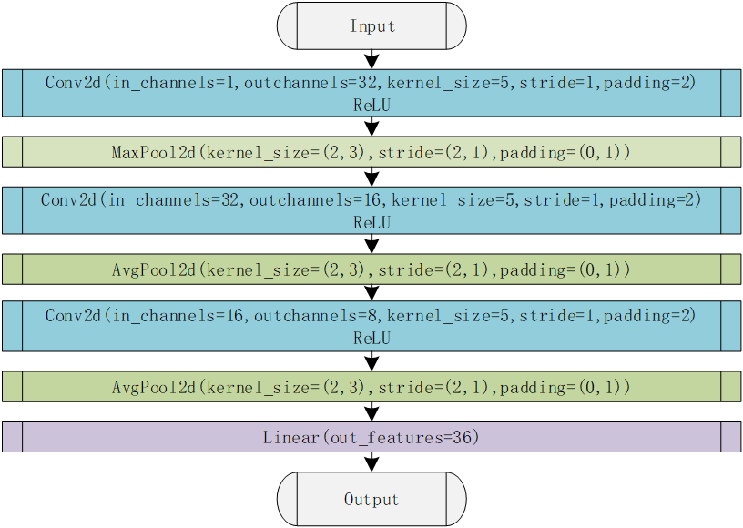
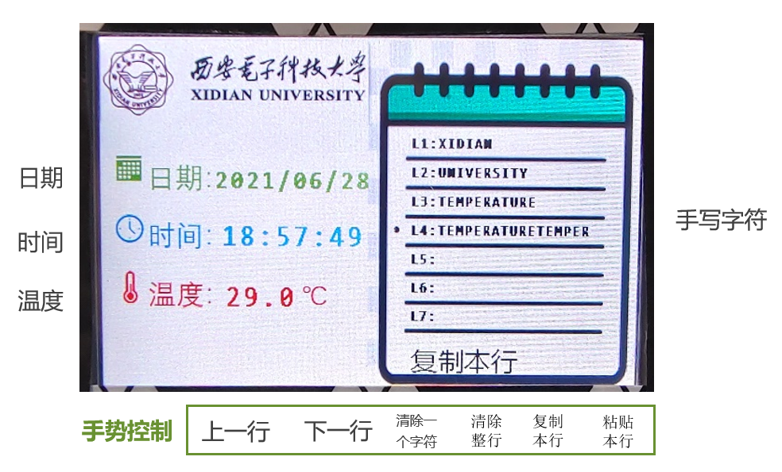

# In-air Handwritten Characters Recognition
This application is a concrete example of deploying a **neural network** on a wearable device. This application can **recognize air-handwritten characters** through wearable devices and display them on the wearable terminal. In addition, the recognition result can be transmitted to another terminal via **WIFI**, and people can perform simple text editing on this terminal through **gesture control**. And it can also broadcast voice, record temperature and time data, etc. This application can help researchers record data while doing experiments without the need to hold a pen or keyboard to input with gloves.

- [Introduction](#Introduction)
  - [Function](#Function)
  - [System Architecture](#System-Architecture)
    - [Hardware Architecture](#Hardware-Architecture)
    - [Software Flow](#Software-Flow)
    - [Neural network structure](#Neural-network-structure)
    - [UI](#UI)
- [Hardware and Software Setup](#Hardware-and-Software-Setup)
  - [Required Hardware](#Required-Hardware)
  - [Required Software](#Required-Software)
  - [Hardware Connection](#Hardware-Connection)
- [User Manual](#User-Manual)
  - [Before Running This Application](#Before-Running-This-Application)
  - [Run This Application](#Run-This-Application)
  - [Makefile](#Makefile)

## Introduction
**In-air Handwritten characters Recognition**

### Function
**1.Sending terminal**
- **In-air handwritten characters recognition**. At present, the in-air handwritten characters that it can recognize through the neural network are numbers 0-9 and capital letters A-Z. When the button is pressed, the air handwritten characters will be recognized, and when the button is released, the characters will not be recognized
- **Oled real-time display**.  Oled displays the recognized in-air handwritten characters in real time
- **Wifi transmission**. Transmit the recognized in-air handwrittencharacters to the receiving terminal via wifi

**2.Receiving terminal**
- **Wifi transmission**. Receive recognized in-air handwritten characters from the sending terminal
- **Serial screen display**. Serial screen records in-air handwritten characters, current ambient temperature data and real-time clock information
- **Voice broadcast**. The received air handwritten characters are read out by the voice module
- **Gesture Recognition**. The infrared gesture recognition module can perform the operations of "previous line", "next line", "clear a character", "clear the entire line", "copy this line" and "paste this line" on the characters displayed on the serial screen. The detailed control commands are as followed:

| Command                | Gesture        | 
| ---------------------- | -------------- |
| previous row       | up             |
| Next line              | down           |
| Clear a character          | left           |
| Clear the entire line              | right          |
| Copy this line    | forward        |
| Paste this line | backward       |
### System Architecture
#### Hardware Architecture

#### Software Flow

#### Neural network structure

### UI

## Hardware and Software Setup
### Required Hardware

- 2 ARC IoT Development Kit（IoTDK）
- 2 NRF24L01 Wireless communication module
- 1 MPU9250（IoTDK include it） 
- 1 Button
- 1 OLED module
- 1 PAJ7620U2 gesture sensor
- 1 DGUS serial screen
- 1 I2C to UART module
- 1 Power converter module for the serial screen
- 1 SYN6288 speech synthesis module
- 1 DHT11 temperature and relative humidity sensor
- 1 DS1302 real-time clock module
- 2 Micro SD Card for IoTDK second bootloader
- 1 Micro SD Card for the initialization of the serial screen

### Required Software
- [embARC Open Software Platform(OSP)](https://github.com/foss-for-synopsys-dwc-arc-processors/embarc_osp)
-  [embARC Machine Learning Inference Library (MLI）](https://github.com/foss-for-synopsys-dwc-arc-processors/embarc_osp/tree/embarc_mli)
-  ARC GNU Tool Chain
- Serial port terminal, such as putty, tera-term or minicom
- [DGUS_V3788](http://www.dwin.com.cn/home/Index/download_file?download_id=1753) for serial screen UI development

### Hardware Connection
1. IoTDK1——Sending terminal
   
  | Device             | Bus    | Connector    | Description                                    |
| ------------------ | ------ | ------------ | ---------------------------------------------- |
| Button|  | GPIO_4B1(2)  | Control the operation of the neural network                  |
| OLED             | I2C0 |  |Display characters|
| NFR2101            |  | GPIO_8B10[0:5]  | wifi transmission                     |
| MPU9250 | I2C_0  || In_air handwritten character data reading |
2. IoTDK2——Receiving terminal
  
 | Device             | Bus    | Connector    | Description                                    |
| ------------------ | ------ | ------------ | ---------------------------------------------- |
| SYN6288 | UART1 | | Speech synthesis |
| DHT11 | | GPIO_4B1(3) | Read temperature data|
| DS1302 | | GPIO_4B1[0:2] |Read time data|
|DGUS | I2C0 |  | Serial screen |
|NFR2101| | GPIO_8B10[0:5] | wifi transmission   |
|PAJ7620| I2C0 | | Gesture Recognition |

## User Manual
### Before Running This Application
- download source code of **In-air Handwritten Characters Recognition** 

- Initialize Smart Screen UI Copy the whole directory /DGUS_Project/DWIN_SET to an empty Micro SD card, and then insert it to the slot on the smart screen. Power up the screen and complete the initialization, then pull out the Micro SD card and reboot the screen. the UI project file can be modified with DGUS_V7388 IDE.
- Make sure all connection is correct again.
### Run This Application
Here take IoTDK, CUR_CORE = arcem9d with ARC GNU Toolchain 2020.09 for example to show how to run this application.  
1. To build this applicaiton, use this command `make` 
2. To run this applicaiton, use this command `make run` 
3. Open your serial terminal such as Putty on PC, and configure it to right COM port and 115200bps.  
4. Wear the sending terminal on the palm of your hand, press the button and write in the air, release the button to see the recognition result of the air handwritten characters.
#### Makefile

- Selected embarc_mli here, then you can use [embarc_mli API][4] in your application:
    
      # Library
      LIB_SEL = embarc_mli

- Target options about EMSK and toolchain:

		BOARD ?= iotdk
        BD_VER ?= 10
		CUR_CORE ?= arcem9d
		TOOLCHAIN ?= gnu

- The relative series of the root directory, here the path of the Makefile is `./embarc_osp-embarc_mli/embarc_applications/XDU_In-air_handwritten_characters_recognition/src/In-air_handwritten_characters_recognition_tx/makefile`:

		#
		# root dir of embARC
		#
		EMBARC_ROOT = ../../../..
- The relative series of the root directory, here the path of the Makefile is `./embarc_osp/embarc_applications/XDU_In-air_handwritten_characters_recognition/src/In-air_handwritten_characters_recognition_rx/makefile`:

		#
		# root dir of embARC
		#
		EMBARC_ROOT = ../../../..

- The middleware used in your application:

		MID_SEL = common
- Directories of source files and header files:
		 
		# application source dirs
		APPL_CSRC_DIR = .
		APPL_ASMSRC_DIR = .
		
		# application include dirs
		APPL_INC_DIR = .
		
		# application defines
		APPL_DEFINES =
		
		# include current project makefile
		COMMON_COMPILE_PREREQUISITES += makefile
		
		### Options above must be added before include options.mk ###
		# include key embARC build system makefile
		override EMBARC_ROOT := $(strip $(subst \,/,$(EMBARC_ROOT)))
		include $(EMBARC_ROOT)/options/options.mk
