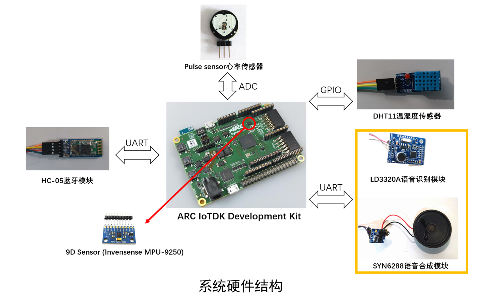
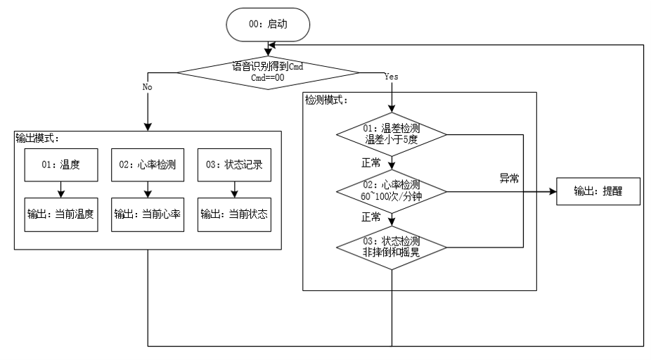
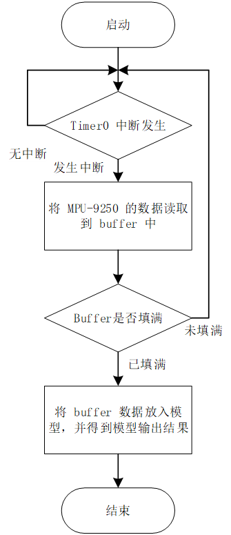

# Smart Belt Based On Neural Network
This application is a specific example of using the smart belt to monitor human health.
This application uses the smart belt to detect the user's heart rate, get exercise status by neural network and use voice to control the belt function to obtain information such as ambient temperature and our physical condition. What's more, these information can be sent to the mobile phone through Bluetooth.


- [Smart Belt Based On Neural Network](#smart-belt-based-on-neural-network)
  - [Introduction](#introduction)
    - [Function](#function)
    - [System Architecture](#system-architecture)
      - [Hardware Architecture](#hardware-architecture)
      - [Software Flow](#software-flow)
  - [Hardware and Software Setup](#hardware-and-software-setup)
    - [Required Hardware](#required-hardware)
    - [Required Software](#required-software)
    - [Hardware Connection](#hardware-connection)
  - [User Manual](#user-manual)
    - [Before Running This Application](#before-running-this-application)
    - [Run This Application](#run-this-application)
  - [Video](#video)


## Introduction
### Function
The smart belt based on neural network mainly realizes the following functions:
Main functions: motion state recognition, heart rate detection, voice control and voice reminder.
Other functions: ambient temperature and humidity detection, Bluetooth transmission.
In this project, we use 9D sensor (mpu-9250) built in arc iotdk development board to realize motion state recognition based on neural network; Use pulse sensor heart rate sensor to detect heart rate; Ld3320a voice recognition module and syn6288 voice synthesis module are used to realize voice control and voice reminder; DHT11 temperature and humidity sensor is used to detect ambient temperature and humidity; Use hc-5 Bluetooth module to realize Bluetooth transmission.
The detailed control commands are as followed:

| Command                  | Voice(Chinese Pinyin)      |
| ------------------------ | -------------------------- |
| Temperature and Humidity | "wen du"                   |
| Heart Rate               | "xin tiao"                 |
| Motion State             | "zhuang tai"               |
| Stop Alarm               | "jie su"                   |


### System Architecture
#### Hardware Architecture
  


#### Software Flow
System Software Flow
  

Motion State Software Flow
  


## Hardware and Software Setup
### Required Hardware
- 1 DesignWare ARC IoT Development Kit(IoTDK)
- 1 LD3320A Voice recognition module
- 1 HC-05 Bluetooth to UART transceivers
- 1 DHT11 temperature and relative humidity sensor
- 1 SYN6288 speech synthesis module
- 1 MAX30102 PulseSensor


### Required Software
- embARC Open Software Platform(OSP)
- ARC GNU Tool Chain
- Serial Port Utility or other serial port terminal
- Bluetooth serial communication assistant(BlueSPP)


### Hardware Connection

| Device             | Bus    | Connector    | Description                                    |
| ------------------ | ------ | ------------ | ---------------------------------------------- |
| HC-05              | UART_2 | uart2        | Bluetooth transceiver for connecting smartphone|
| DHT11              | GPIO   | GPIO8b_0[4]  | Temperature and relative humidity sensor       |
| LD3320A            | UART_1 | uart1_rxd    | Voice recognition module                       |
| SYN6288            | UART_1 | uart1_txd    | speech synthesis module                        |
| PulseSensor        | ADC    | J1:ADC0      | Detect pulse sensor                            |


## User Manual
### Before Running This Application
1. If you want to transfer the data to the mobile phone,please download [BlueSPP](https://pan.baidu.com/s/1lNGEwsjWSztfxqkhomAPlg) on the phone.

### Run This Application
Before programming IoTDK, PMOD mux must be configured in order to use bus drivers of IoTDK.
This operation is to make the ADC port work normally.
```c
// In file "embarc_osp-embarc_mli\embarc_osp-embarc_mli\board\iotdk\drivers\mux\mux.c"
void io_mux_init(void)
{
	sysconf_reg_ptr->PMOD_MUX = 0;
	sysconf_reg_ptr->ARDUINO_MUX = 1;
}
```

Makefile target options about IoTDK and toolchain:
```makefile
APPL ?= smartbelt
BOARD ?= iotdk
EXT_DEV_LIST += sensor/imu/mpu9250
CUR_CORE = arcem9d
APPL_DEFINES = -DUSE_APPL_MEM_CONFIG -DV2DSP_XY -DMODEL_BIT_DEPTH=16 -g
TOOLCHAIN ?= gnu
OLEVEL = O0
```

Directories of source files and header files:

```makefile
EMBARC_ROOT = ../../..

# use -Hpurge option to optimize the code size
ifeq ($(TOOLCHAIN), gnu)
ADT_COPT += -ffunction-sections -fdata-sections
ADT_LOPT += -Wl,--gc-sections
else
ADT_COPT += -Hpurge
ADT_LOPT += -Hpurge
endif

LIB_SEL = embarc_mli
MID_SEL = common

# application source dirs
APPL_CSRC_DIR = . model
APPL_ASMSRC_DIR = .

# application include dirs
APPL_INC_DIR = . model

# include current project makefile
COMMON_COMPILE_PREREQUISITES += makefile

### Options above must be added before include options.mk ###
# include key embARC build system makefile
include $(EMBARC_ROOT)/options/options.mk
```

Then `make run`

## Video
[Show video](https://v.youku.com/v_show/id_XNTE5MTU0MjIwOA==.html)